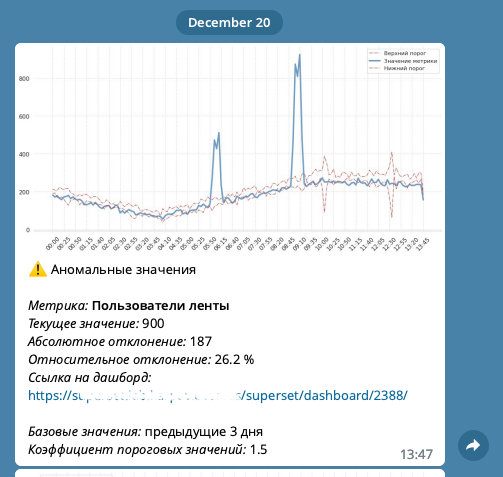

## Система автоматического обнаружения аномалий в данных

**Стек:** Python, Numpy, Pandas, Seaborn, SQL, Clickhouse, Airflow, Telegram

Система осуществляет мониторинг среднего значения заданной метрики каждые 15 минут.

Это значение сравнивается с порогами, посчитанными для аналогичных значений метрики в данных интервалах за предыдущие 3 дня. В случае выхода за пределы порогов, ответственному лицу отправляется сообщение в мессенджере Telegram (пример сообщения на скриншоте ниже). SQL-запросы вынесены в отдельный файл.  
&nbsp;

